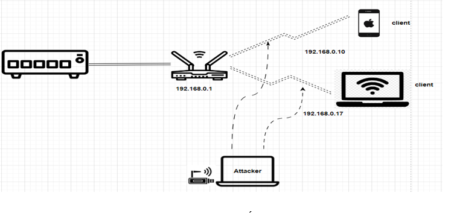

# Building a Model and Scenario for Cracking WiFi Passwords WEP, WPA/WPA2

**Sinh viên thực hiện:**
- Nguyễn Hoàng Phúc - 20520277
- Võ Thị Hưởng - 19520586
- Hồ Văn Phước - 22521151

## I. Giới thiệu

### 1. Mục tiêu đồ án
- **Xây dựng mô hình mạng không dây đơn giản**: Bao gồm switch, router và các thiết bị kết nối.
- **Thực hiện tấn công brute force**: Nhắm vào các giao thức bảo mật WEP 64-bit, WEP 128-bit, WPA-PSK AES-128 bit để crack mật khẩu.

### 2. Kỹ thuật tấn công
- **ARP Request Replay**: Tạo ra lưu lượng dữ liệu giả để bắt gói tin.
- **Fake Authentication**: Giả mạo một client để kết nối với AP (Access Point).
- **Deauthentication**: Ngắt kết nối giữa AP và client để bắt gói tin Handshake.

### 3. Tools
- **Aircrack-ng**: Bộ công cụ mạnh mẽ cho tấn công crack mật khẩu WiFi.
- **Wifite**: Công cụ tự động hóa tấn công WiFi.
- **Crunch**: Tạo wordlist cho tấn công brute force.

### 4. Mô hình mạng và cấu hình hệ thống

#### a. Mô hình mạng
  

#### b. Cấu hình hệ thống
- **Kết nối mạng**: Sử dụng Ethernet để kết nối từ switch đến router WiFi TL-WR940N.
  
- **Cấu hình router WiFi TL-WR940N**:
  - **WEP**:
    - Định dạng mã ASCII: 64-bit và 128-bit.
    - Mã hóa: RC4.
    - Password: `1234a` cho 64-bit, `1234567890uit` cho 128-bit.
  - **WPA2**:
    - Phiên bản: WPA2-PSK.
    - Mã hóa: AES-128 bit.
    - Password: `12345670a`.
    
- **USB-WiFi TL-WN722N**: Chế độ monitor để bắt gói tin.

### 5. Tổng quan kịch bản tấn công

#### a. Brute force crack password WEP 64-bit với Aircrack-ng
- **Scanning**: Dò quét các mạng WiFi sử dụng WEP, lưu gói tin bắt được vào file `.cap`.
- **Tấn công Fake Authentication và ARP Request Replay**: Tạo lưu lượng dữ liệu nếu mạng có ít hoạt động.
- **Crack mật khẩu**: Thu thập các gói tin chứa key IV và sử dụng Aircrack-ng để crack mật khẩu.

#### b. Brute force crack password WEP 128-bit với Wifite
- **Dò quét mạng**: Sử dụng Wifite để tìm các mạng WiFi sử dụng WEP.
- **Crack mật khẩu tự động**: Wifite tự động thu thập gói tin `.cap` chứa key IV và crack mật khẩu.

#### c. Dictionary attack crack password WPA2-PSK với Aircrack-ng
- **Scanning**: Dò quét và thu thập gói tin Handshake vào file `wpa_handshake-02.cap`.
- **Tấn công Deauthentication**: Ngắt kết nối giữa router WiFi và client để bắt gói tin Handshake.
- **Crack mật khẩu**: Sử dụng phương pháp dictionary attack để crack mật khẩu WPA2-PSK.

## II. Demo
1. **Video demo**: [YouTube](link_to_your_video)
2. **Report**: [Link Docx](https://docs.google.com/document/d/1b4xQyaustxm1a1nCaRF3CXA_Yj1PQQ5O/edit?usp=sharing&ouid=112571363348012562723&rtpof=true&sd=true)
